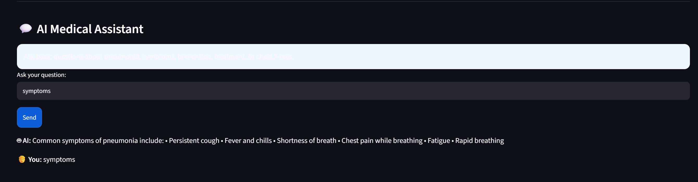
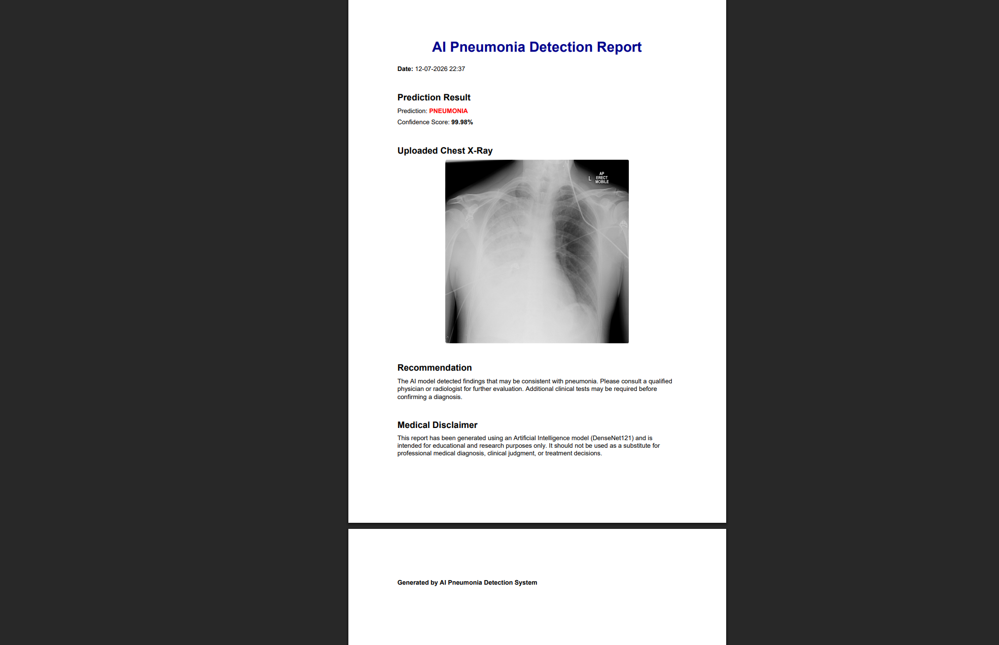

# 🫁 AI Pneumonia Detection System

A professional AI-powered web application built with **Streamlit** and **TensorFlow DenseNet121** for detecting pneumonia from Chest X-ray images.

---

## Features

* 🫁 Pneumonia Detection using DenseNet121
* 📷 Upload Chest X-ray images (JPG, JPEG, PNG)
* 🔥 Grad-CAM visualization
* 📊 Prediction confidence score
* 📄 Downloadable PDF medical report
* 💬 AI Medical Chatbot
* 🎨 Professional Streamlit Medical UI
* ⚡ Fast and easy to use

---

## Project Structure

```
AI_Pneumonia_Detection/
│
├── app.py
├── gradcam.py
├── chatbot.py
├── report.py
├── utils.py
├── requirements.txt
├── README.md
├── best_pneumonia_model.keras
└── assets/
```

---

## Installation

### 1. Clone or Download the Project

```bash
git clone <repository_url>
cd AI_Pneumonia_Detection
```

### 2. Create a Virtual Environment (Optional)

Windows:

```bash
python -m venv venv
venv\Scripts\activate
```

Linux/macOS:

```bash
python3 -m venv venv
source venv/bin/activate
```

### 3. Install Dependencies

```bash
pip install -r requirements.txt
```

---

## Model

Place your trained model file inside the project folder:

```
best_pneumonia_model.keras
```

---

## Run the Application

```bash
streamlit run app.py
```

The application will open in your default browser.

---

## How to Use

1. Launch the application.
2. Upload a Chest X-ray image.
3. Wait for the AI prediction.
4. View the prediction and confidence score.
5. Inspect the Grad-CAM heatmap.
6. Download the generated PDF report.
7. Ask pneumonia-related questions using the AI chatbot.

---

## Technologies Used

* Python
* Streamlit
* TensorFlow / Keras
* DenseNet121
* OpenCV
* NumPy
* Pillow
* ReportLab
* Matplotlib

---

## Medical Disclaimer

This application is intended for educational and research purposes only.

The prediction generated by the AI model is **not a medical diagnosis** and should not replace the opinion of a qualified healthcare professional.

Always consult a physician or radiologist for medical decisions.

---

## Author

Developed as an AI Pneumonia Detection project using Deep Learning, Streamlit, and Grad-CAM.
## Model File

The trained model (`best_pneumonia_model.keras`) is not included in this repository because it exceeds GitHub's upload size limit.

To run the application:

1. Place the trained model file in the project root.
2. Ensure it is named:
   `best_pneumonia_model.keras`
3. Install the required dependencies:
   ```bash
   pip install -r requirements.txt
   ```
4. Start the application:
   ```bash
   streamlit run app.py
   ```
## Application Screenshots

### Home Page


### X-ray Upload (Normal)


### X-ray Upload (Pneumonia)


### Prediction Result (Normal)


### Prediction Result (Pneumonia)


### Grad-CAM Visualization


### AI Medical Assistant


### PDF Report

